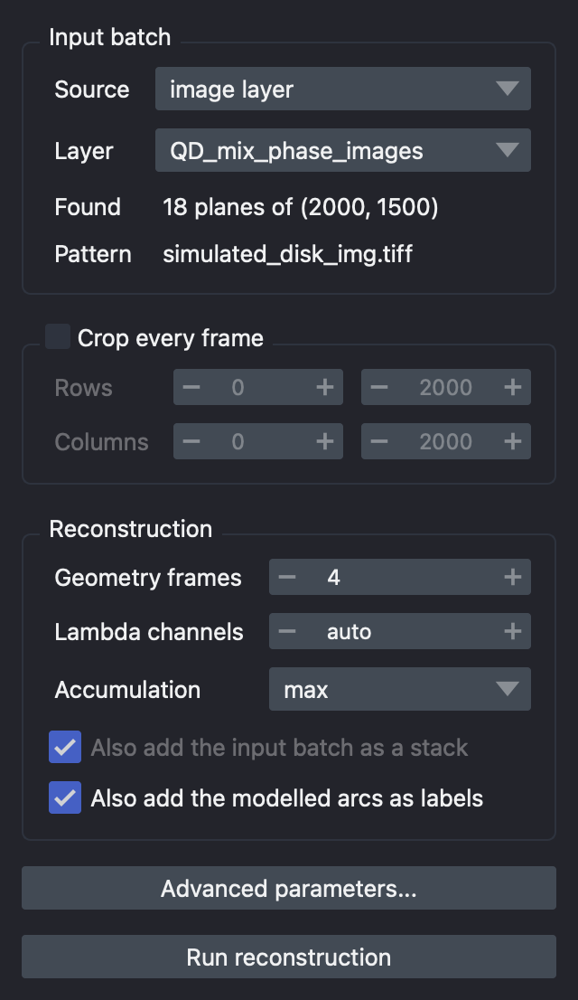
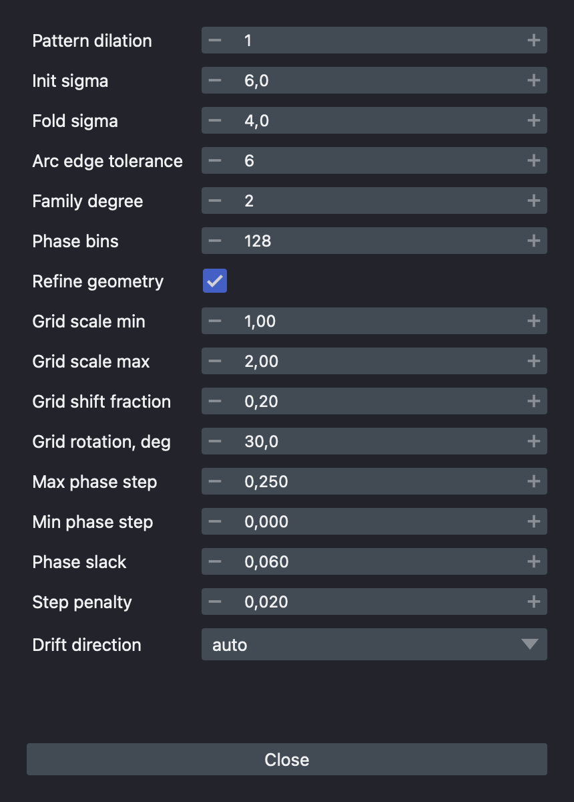
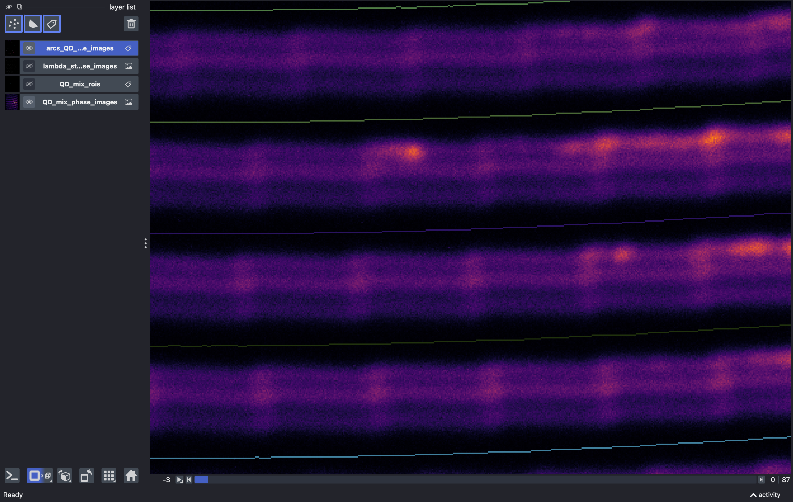
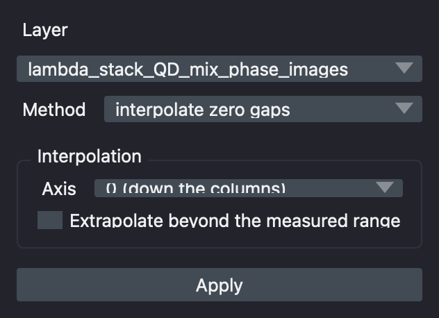
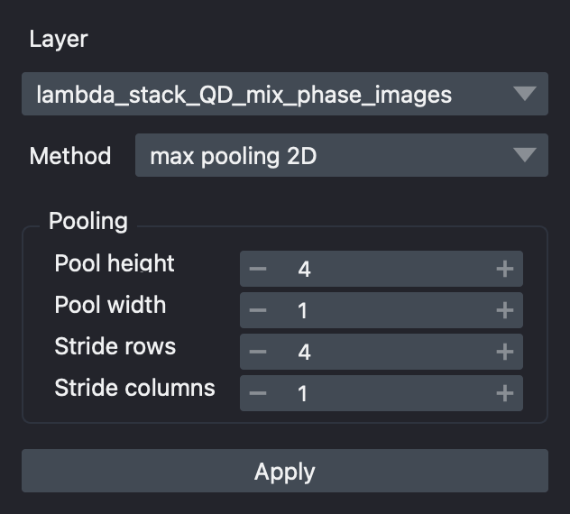
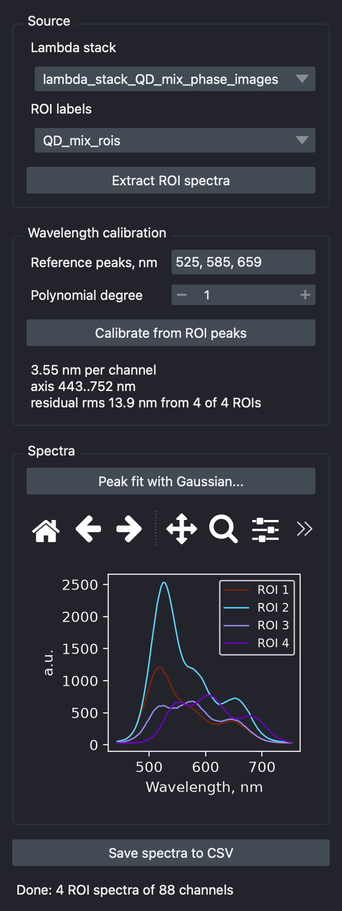
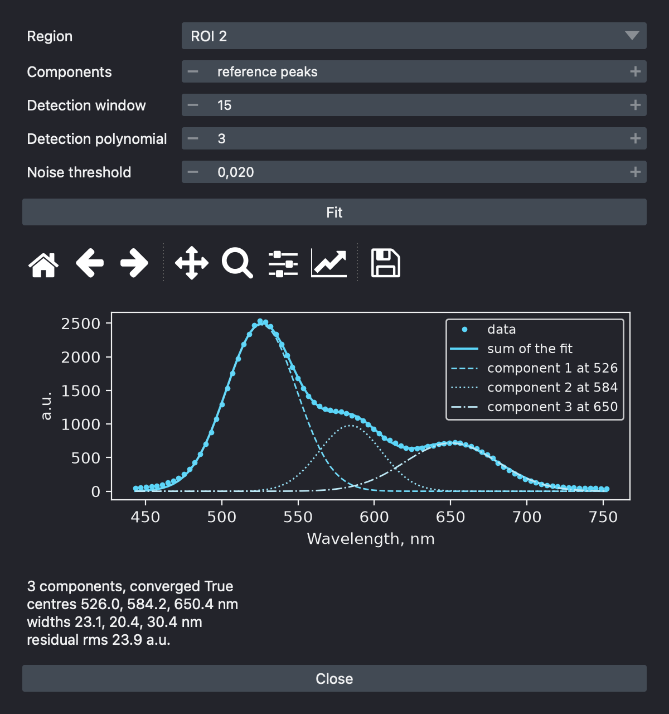

# spectra-spin-napari

[](https://stand-with-ukraine.pp.ua)

A [napari](https://napari.org) plugin for hyperspectral reconstruction of spinning-disk spectral microscopy data.

A series of monochrome phase images, taken through a modified spinning-disk confocal with a dispersing prism, is turned into a hyperspectral lambda-stack `(lambda, height, width)`: the plugin fits one shared geometry to the disk pattern, follows the phase of that pattern through the series, samples the spectral bands it defines, and assembles them into an image. The spectra of regions of interest can then be measured, calibrated to nanometres, decomposed into emitters and exported.

The processing code is the unmodified code of the [Spectra-Spin](https://github.com/wisstock/spectra-spin) project: `phase_model_recon.py` (the `PhaseModelRecon` class) and `utils.py` (post-processing and spectral analysis). Every algorithmic detail is documented in the docstrings of those two modules. `_widgets.py` holds the GUI only.

## Contents

- [Installation](#installation)
- [Sample data](#sample-data)
- [Widgets](#widgets)
  - [Phase model reconstruction](#phase-model-reconstruction)
  - [Stack post-processing](#stack-post-processing)
  - [ROI spectra and calibration](#roi-spectra-and-calibration)
- [Example: the whole chain on the sample data](#example-the-whole-chain-on-the-sample-data)

# Installation

## Requirements
- Python >= 3.11
- numpy >= 2.0.
- scipy >= 1.13
- scikit-image >= 0.24
- matplotlib >= 3.9
- PySide6
- napari >= 0.5 (tested on 0.9)

## 1. Create an environment and install napari

Any environment manager works; these are the steps for conda.

```bash
conda create -y -n napari-env -c conda-forge python=3.12
conda activate napari-env
conda install -c conda-forge napari pyside6
```

## 2. Install the plugin

```bash
git clone https://github.com/wisstock/spectra-spin-napari.git
cd spectra-spin-napari
python -m pip install .
```

# Sample data

**File - Open Sample - Spectra-Spin** contributes two datasets, enough to run
everything the plugin does without any data of your own.

| Sample | Layer | Shape | Content |
|---|---|---|---|
| QD mix phase images | `QD_mix_phase_images`, image | `(18, 2000, 1500)` uint16 | 18 phase images of a mix of quantum dots emitting at 525, 585 and 659 nm |
| QD mix regions of interest | `QD_mix_rois`, labels | `(2000, 1500)` uint32 | four regions drawn on the reconstruction of that batch |

The batch is stored as one compressed stack holding the crop
`[500, 2500, 1000, 2500]` of the raw 3000 x 4096 camera frames - 60 MB
against the 422 MB of the raw series, and exactly the region the reference
workflow reconstructs. Because the crop is already applied, leave *Crop every
frame* off when reconstructing it.


# Widgets

| Widget | Input | Output |
|---|---|---|
| [Phase model reconstruction](#phase-model-reconstruction) | a folder of phase images, or an image layer | the lambda stack, and optionally the input batch and the modelled arcs |
| [Stack post-processing](#stack-post-processing) | any image layer | a filled or a pooled copy |
| [ROI spectra and calibration](#roi-spectra-and-calibration) | a lambda stack and a labels layer | spectra, a wavelength calibration, a flattened mask, a CSV file |

All three run their work in a background thread, so the viewer stays
responsive, and all three show the `logging` output of the processing modules
in a status line under the progress bar.

Layers created by the plugin are named with underscores and no spaces, so a
layer name is also a usable file name when the layer is saved.

## Phase model reconstruction

Runs `PhaseModelRecon.run()`, then `lambda_stack_recon()`, and adds the
result as an image layer.



### Input batch

| Parameter | Default | Description |
|---|---|---|
| `Source` | folder of phase images | Where the frames come from: a folder on disk, or a 3D image layer already open in the viewer. |
| `Folder` | - | Folder of phase images. Files are sorted by name, which **must** be the acquisition order: the phase trajectory is constrained to advance in one direction over it. |
| `File mask` | `*.tif*` | Glob applied inside the folder. |
| `Layer` | - | 3D image layer whose planes are the phase images, in acquisition order. Shown instead of the folder rows when the source is a layer. |
| `Found` | - | How many images the current source holds. |
| `Pattern` | `simulated_disk_img.tiff` | The simulated disk pattern bundled with the plugin. It is not asked for: it belongs to the instrument, not to a batch. On first use it is rotated by 180 degrees to match the camera orientation, and skeletonised to the one-pixel-wide lines the line family model is fitted to. |

### Crop every frame

Optional `[row_min, row_max, col_min, col_max]` slice applied to every frame
as it is read. Off by default.

### Reconstruction

| Parameter | Default | Description |
|---|---|---|
| `Geometry frames` | 4 | Number of evenly spaced frames used to estimate the shared geometry. |
| `Lambda channels` | auto | Resampled spectral channels per band. `auto` uses the rounded median line spacing, which resamples a band without losing resolution. |
| `Accumulation` | max | How frames writing to the same image row are combined: `max`, `mean` or `overwrite`. |
| `Also add the input batch as a stack` | on | Add the frames as they were read, crop included, as an image layer. Disabled when the source already is a layer. |
| `Also add the modelled arcs as labels` | on | Add the arcs of every frame as a labels layer. |

### Advanced parameters

The rest of the `PhaseModelRecon` signature, in a window of its own so that
sixteen rows that are set once do not make the dock taller than the screen.



| Group | Parameters |
|---|---|
| Preprocessing | `Pattern dilation`, `Init sigma`, `Fold sigma` |
| Line family model | `Arc edge tolerance`, `Family degree`, `Phase bins` |
| Geometry search | `Refine geometry`, `Grid scale min`/`max`, `Grid shift fraction`, `Grid rotation` |
| Phase trajectory | `Max phase step`, `Min phase step`, `Phase slack`, `Step penalty`, `Drift direction` |

### Output layers

| Layer | Type | Shape | Content |
|---|---|---|---|
| `lambda_stack_<batch>` | image, uint16 | `(n_lambda, height, width)` | the hyperspectral cube |
| `input_batch_<batch>` | image, float32 | `(n_image, height, width)` | the frames as the reconstruction read them |
| `arcs_<batch>` | labels, uint16 | `(n_image, height, width)` | the modelled arcs, one label per arc |

Every arc keeps its own label value and that value means the same
physical arc in every frame - step through the frames and one label is one arc
moving.



## Stack post-processing

| | |
|---|---|
|  |  |

**interpolate zero gaps** - `interpolate_zero_gaps()`. Fills the empty rows by linear interpolation along one axis, treating zero pixels as missing data.

| Parameter | Default | Description |
|---|---|---|
| `Axis` | 0 | Interpolation axis. The gaps are horizontal stripes, so interpolating down the columns is what closes them. |
| `Extrapolate` | off | Whether to extend the first and last measured value of a column into the gaps beyond them. Off keeps the reconstruction honest about where it has no data at all. |

**max pooling 2D** - `max_pooling2d()`. Trades resolution for coverage: every output pixel is the brightest input pixel of its window, so a window that spans a filled row always lands on real data.

| Parameter | Default | Description |
|---|---|---|
| `Pool height`, `Pool width` | 4, 1 | Window. A tall narrow window is the useful shape, because the gaps are horizontal stripes: height buys coverage, width only throws away column resolution that was never missing. |
| `Stride rows`, `Stride columns` | 4, 1 | Step between windows. Equal to the window gives non-overlapping windows. |

The pooled layer is added with a `scale` equal to the stride, so it stays aligned with its source in the viewer. Pooling is a display and screening tool: because it keeps peaks and discards everything else, it is biased upwards and is not a step to run before quantitative spectroscopy.

## ROI spectra and calibration



### 1. Source

| Parameter | Description |
|---|---|
| `Lambda stack` | The 3D image layer to measure. |
| `ROI labels` | A labels layer holding the regions - 2D or 3D label layer, painted with the napari brush, loaded as a mask, or the bundled sample. |

### 2. Wavelength calibration

| Parameter | Default | Description |
|---|---|---|
| `Reference peaks, nm` | 525, 585, 659 | Known emission peaks of the sample, comma separated. |
| `Polynomial degree` | 1 | Degree of the fit from channel index to wavelength. Prism dispersion may be not exactly linear, so 2 is worth trying once there are enough reference peaks. |

*Calibrate from ROI peaks* fits the peaks of every ROI spectrum and feeds the fitted centres of all of them at once to `spectral_calibration()`. The result line reports the dispersion in **nm per channel**, the calibrated range and the fit residual.

Only the ROIs whose fit returns exactly as many components as there are reference wavelengths enter the calibration - with a different number there is no way to say which fitted peak belongs to which emitter - and the widget says how many were used.

### 3. Spectra

The plot, in channels until the axis is calibrated and in nanometres afterwards, with the matplotlib toolbar for zooming and for saving the figure. Every curve carries the colour napari gives its ROI.

### 4. Peak fit with Gaussian

The decomposition of one region into emitters, in a window of its own: the data as points, the sum of the fit, and every component drawn separately in a shade of the region's colour, labelled with its centre.



| Parameter | Default | Description |
|---|---|---|
| `Region` | first | Which extracted region to fit. |
| `Components` | reference peaks | Number of Gaussians. Setting it to the number of emitters actually in the sample is the single most effective thing you can do for the stability of the fit. |
| `Detection window` | 15 | Savitzky-Golay window in channels: the smallest structure that survives the peak detection. |
| `Detection polynomial` | 3 | Polynomial order of that filter. |
| `Noise threshold` | 0.02 | A candidate below this fraction of the maximum is rejected as baseline. |

### 5. Save spectra to CSV

One row per spectral channel:

| Column | Format | Present |
|---|---|---|
| `lambda_index` | integer | always |
| `wavelength_nm` | one decimal | when the axis is calibrated |
| `roi_<label>` | full precision | one per region |

```
lambda_index,wavelength_nm,roi_1,roi_2,roi_3,roi_4
0,443.3,42.7738,49.9025,34.9604,31.3488
1,446.8,51.0518,57.8027,35.8919,28.3496
```